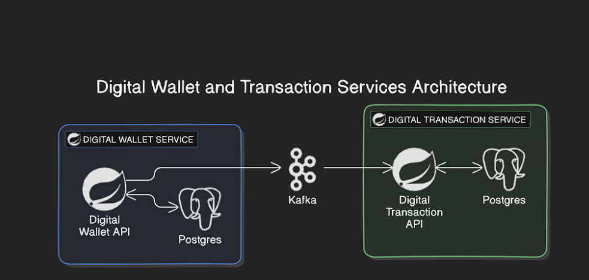

# Digital Wallet Service

This is a simple Digital Wallet system built using Java and Spring Boot.

## Features

- **Wallet Management**: Allow clients create accounts and transactions in a digital wallet service;
- **Integration with Messaging Service**: Utilizes Kafka for asynchronous communication between microservices.
- **Multi-module Project Structure**: Organized into separate modules for better code organization and maintenance.

## Dependencies

- Java 21
- Spring Boot
- Maven
- Kafka
- PostgreSQL

## Modules

1. **digital-wallet-core**: Contains the core business logic and domain models.
2. **digital-wallet-domain**: Contains the core domain models and business logic for the digital wallet system
3. **digital-wallet-http-resources**: Implements RESTful APIs using Spring Web for handling wallet requests.
4. **digital-wallet-messaging**: Integrates with Kafka for handling messaging-related tasks.
5. **digital-wallet-persistence**: Handles persistence using JPA and provides repositories for accessing database entities. 
6. **digital-wallet-processor**: Module contains the core domain models and business logic.


## Clone the Repository

```shell
    git clone https://github.com/fabiofreire1208/digital-wallet-challenge.git
```

## Build

To build the project, you can use the Maven command provided below. This command will clean the project and then package it, using two CPU cores to speed up the process:

```shell
mvn -T 2C clean package
```

## Configuration

- **Database Configuration**: Configure database settings in `application.properties` files located in each module.
- **Messaging Configuration**: Set up Kafka connection properties in `application.properties` files in the messaging module.


## Api Request

The following requests contains comprehensive information for a complete creation of a transaction, including client creation, account and transaction history.

Create Client
```shell
curl --request POST \
  --url http://localhost:8080/api/wallet/client/create \
  --header 'Content-Type: application/json' \
  --header 'User-Agent: insomnia/10.1.0' \
  --data '{
	"name": "Teste1",
	"document": "99999999999",
	"email": "teste@gmail.com",
	"phone": "849816543"
}'
```

Create Account
```shell
curl --request POST \
  --url http://localhost:8080/api/wallet/account/create \
  --header 'Content-Type: application/json' \
  --header 'User-Agent: insomnia/10.1.0' \
  --data '{
	"balance": 1000.00,
	"client_info": {
		"document": "99999999999"
	}
}'
```

Create Transaction
```shell
curl --request POST \
  --url http://localhost:8080/api/wallet/transaction/create \
  --header 'Content-Type: application/json' \
  --header 'User-Agent: insomnia/10.1.0' \
  --data '{
	"accountFrom": {
		"accountNumber": "345024067"
	},
	"accountTo": {
		"accountNumber": "036004078"
	},
	"amount": 200.00,
	"transactionType": "DEPOSIT"
}'
```

## Running the Project

To start the project, you need to use Docker Compose. Make sure Docker and Docker Compose are installed on your machine. The docker-compose.yml file can be found in the root folder of the project.

To run the project, follow these steps:

1. **Navigate to the directory containing the docker-compose.yml file:**

2. **Run the following command in the terminal:**

```shell
docker-compose up
```
This command will:

- **Download all the necessary Docker images.**
- **Build the containers defined in the docker-compose.yml file.**
- **Start all the project services configured to run in Docker containers.**


## System Design



According to the figure above, the entire structure is running in docker containers. We have 2 microservices digital-wallet-service and transaction-wallet-service. Both are connected through Apache Kafka, and each has its own PotgresSQL database for persistence. Based on EDA we have a central orchestrator that receives a transaction and process it between the different services.

